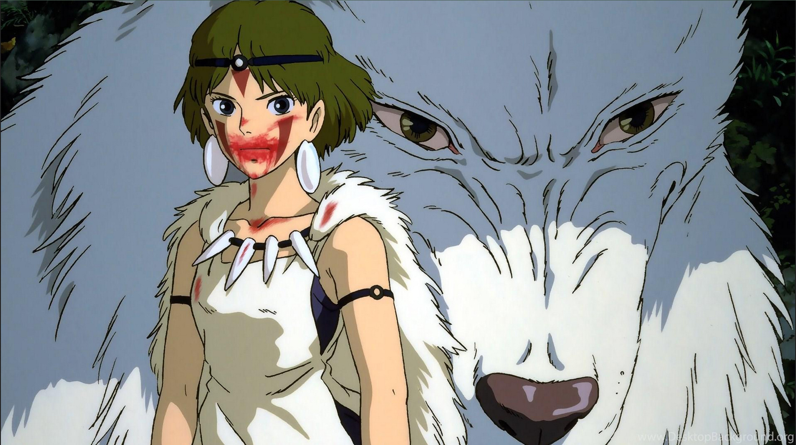
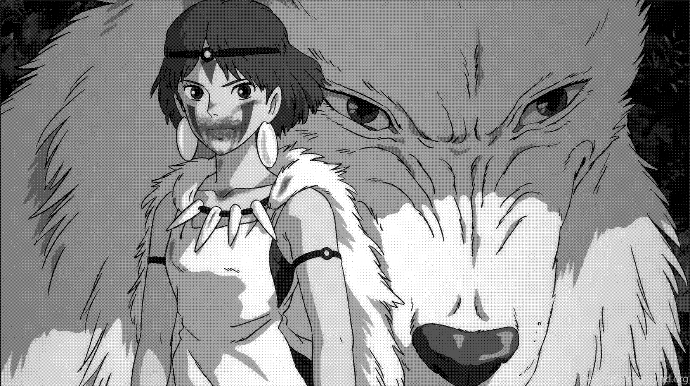
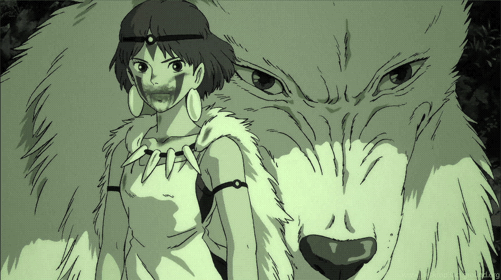

# Jyva

Jyva is a minimalist image transformation toolkit inspired by the aesthetic of Low-tech Magazine. It allows you to convert images into compressed monochrome PNGs using grayscale quantization, customizable dithering algorithms (like Bayer dithering), and optional color tinting. Ideal for eco web design.

## Visual Example

Here's how Jyva transforms your images through each step:

| Original | Grayscale | Dithered | Green Tinted |
|----------|-----------|----------|--------------|
|  |  |  |  |

## Installation

```bash
npm install
```

Make sure you have the required dependencies:
- `pngjs` for PNG manipulation
- `upng-js` for PNG-8 palette encoding
- TypeScript for development

## Usage

### Basic Example

 → 

```typescript
import fs from "fs";
import { PNG } from "pngjs";
import { toGrayscale } from "./core/grayscale";
import { bayerDither, makeGreen } from "./core/floyds_steinberg";
import { encodePNG8 } from "./core/palette";

// Load your image
const input = PNG.sync.read(fs.readFileSync("your-image.png"));
const rgba = new Uint8ClampedArray(input.data.buffer, input.data.byteOffset, input.data.byteLength);

// Apply transformations
const gray = toGrayscale(rgba);
const dithered = bayerDither(gray, input.width, 4, 8);
const tinted = makeGreen(dithered);

// Save as PNG-8 with palette
const png8bytes = encodePNG8(tinted, input.width, input.height);
fs.writeFileSync("output.png", png8bytes);
```

### Available Functions

#### 1. Grayscale Conversion


The [`toGrayscale`](src/core/grayscale.ts) function converts color images to grayscale using the standard luminance formula:

```typescript
const gray = toGrayscale(rgba, 4); // 4 gray levels
```

**Effect**: Converts color image to monochrome
- Uses luminance weighting (0.299×R + 0.587×G + 0.114×B)
- Quantizes to specified number of gray levels
- Preserves image detail while reducing color complexity

#### 2. Bayer Dithering


The [`bayerDither`](src/core/floyds_steinberg.ts) function applies ordered dithering using Bayer matrices:

```typescript
const dithered = bayerDither(gray, width, 4, 8);
// 4 = number of gray levels
// 8 = Bayer matrix size (2, 4, or 8 supported)
```

**Effect**: Adds texture and reduces color banding
- Creates patterned noise for smoother gradients
- Matrix size 8 provides smoother transitions than 4
- Distinctive retro/low-tech aesthetic

#### 3. Color Tinting


The [`makeGreen`](src/core/floyds_steinberg.ts) function applies a subtle green tint:

```typescript
const tinted = makeGreen(dithered);
```

**Effect**: Applies characteristic green colorization
- Green color cast (R×0.85, G×1.0, B×0.75)
- Maintains the dithered pattern
- Creates the Low-tech Magazine aesthetic

## Complete Workflow

The typical Jyva workflow processes an image through four stages:

1. **Original** → **Grayscale**: Color to monochrome conversion
2. **Grayscale** → **Dithered**: Adds texture and reduces banding
3. **Dithered** → **Tinted**: Applies characteristic green colorization

Each step progressively reduces file size while maintaining visual appeal, perfect for sustainable web design.

## Development

Run the test script to see the full pipeline in action:

```bash
npx ts-node src/dev-test.ts
```

This will process `testpictures/mononoke.png` and generate all intermediate outputs.

## License

MIT License - see [LICENSE](LICENSE) for details.
